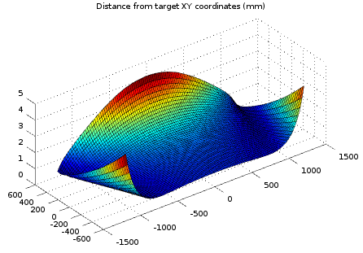

# MaslowCNCModelOnOctave
An Octave (.m) set of scripts to simulate effect of parameters in MaslowCNC kinematics

It was used to prepare this [post on the MaslowCNC community forum](https://forums.maslowcnc.com/t/list-of-sources-of-error/7523/22?u=c0depr1sm)

## Setup
You can [get octave for free](https://www.gnu.org/software/octave/), it is a free open source software for mathematical work.

To start using the modeling tool
1. Clone this repository,
2. [Get Octave](https://www.gnu.org/software/octave/)
3. Launch Octave and change the active directory to the cloned repository by browsing (clicking on the uper-left "file Browser" string selector) 
4. in the octave command window, type 
`sweepdeltaXY_Catenary_and_targeted_Error`
and hit enter.

## Learning how it works
In the Octave editor tab, open a file (menu just above the editor area) and look at the script code)

Open inverse.m where exist experiments of calculations similar to the MaslowCNC firmware function TrinagularInverse() of Kinnamatics.cpp

## Playing with inverse():
Let's get a chain length estimation for a target X,Y coordinate:
Get a plain right chain length value (no flex, no stretch, no sag correction) for the lower left corner by typing:

`inverse(1200, -600,"bare")`

`ans =  3497.1`

You get the parabola sag approximation version here (the one using the sag correction factor)

`inverse(1200, -600,"allparabola")`

`ans =  3498.5`

And here you get the one using a catenary equation (relying on sled weigh and chain density)

`inverse(1200, -600,"allcatenary")`

`ans =  3498.5`

Now the display might show no som many decimal places. You would want to get the parabola to match the catenary, so compute the chain length difference to see more digits:

`inverse(1200, -600,"allparabola")(1)-inverse(1200, -600,"allcatenary")(1)`

`ans =   -7.9500e-04`

## Sweeping a set of XY coordinates then tracing a 3D mesh

The "sweep___.m" functions are essentially doing just that. Comparing different Maslow setups. 
Some use the Forward() function to find back the XY coordinate from a pair of chain lengths. (Like the maslow Firmware)

Others just compare chain lengths by substrating the outcome of two inverse() calls.
